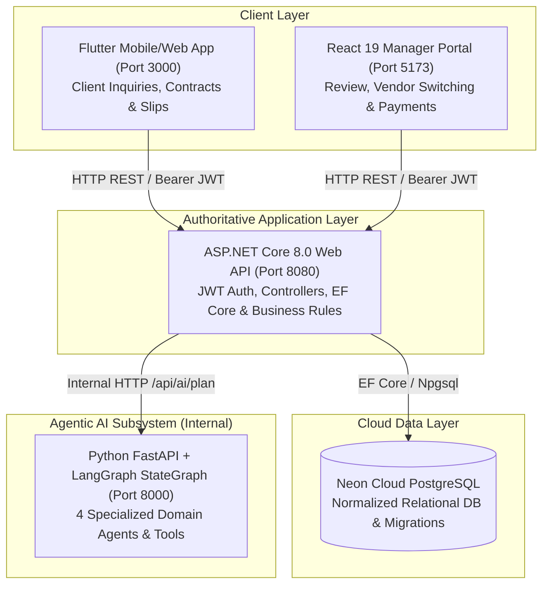
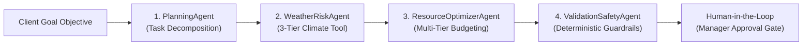

# 🎪 EventCraft AI — Intelligent Event Management & Autonomous Multi-Agent Platform

[](https://github.com/gayax000/EventManagementProject/actions/workflows/backend-ci.yml)
[](https://github.com/gayax000/EventManagementProject/actions/workflows/frontend-ci.yml)
[](https://github.com/gayax000/EventManagementProject/actions/workflows/flutter-web-ci.yml)
[](LICENSE)
[](https://dotnet.microsoft.com/)
[](https://react.dev/)
[](https://flutter.dev/)
[](https://neon.tech/)
[](https://www.langchain.com/langgraph)

---

## 📌 1. Project Overview & Business Problem

### 1.1 Problem Statement
Organizing luxury weddings, corporate banquets, and celebration events in Sri Lanka involves substantial operational friction:
* **Date & Venue Conflicts:** High double-booking risks and opaque banquet hall pricing.
* **Unpredictable Tropical Weather:** Monsoonal rain disruptions impacting outdoor lawns and garden ceremonies without timely safeguards.
* **Budget Overruns & Fragmentation:** Manual negotiation across isolated vendors (catering, line-array audio, fresh flower deco, photography, cakes, and bridal transport).
* **Payment Insecurity:** Unverified bank transfer slips and delayed contract approvals.

### 1.2 The EventCraft AI Solution
**EventCraft AI** is an enterprise-grade, integrated cross-platform system combining:
1. **Client Self-Service Mobile Web App (Flutter):** Interactive event inquiry builder featuring cascading Sri Lankan 25 Districts & Local Towns selection, private residence pricing (hall rental waived), digital contract signing, and bank transfer slip uploads.
2. **Operations & Finance Manager Portal (React):** Real-time event review, verified vendor assignment switches, live draft synchronization, custom logistics add-ons, and payment verification.
3. **Autonomous Multi-Agent AI Subsystem (Python LangGraph):** 4 specialized agents executing dynamic multi-step decomposition, 3-tier Sri Lankan weather risk assessment, multi-tier budget optimization, and deterministic safety guardrails.
4. **Authoritative Enterprise API (ASP.NET Core 8.0 & PostgreSQL on Neon Cloud):** Secure REST API enforcing JWT role-based access, ACID transactions, and persistent audit trace logging.

---

## 👥 2. User Roles & Key Capabilities

| Role | Primary Interface | Key Capabilities |
| :--- | :--- | :--- |
| **Client / Customer** | Flutter Mobile / Web App | Create celebration inquiries, select cascading Districts & Towns, review itemized AI proposals, view weather forecasts, sign contracts digitally, upload bank deposit slips, and mint QR Entry Passes. |
| **Operations Manager** | React Web Portal | Review AI-generated proposals, switch verified vendor allocations, override per-plate / service rates, apply courtesy discounts, verify client payments, and track live work orders. |
| **Verified Vendor** | Vendor Web Portal | Register service packages across multi-tier budgets, review assigned event work orders, and coordinate dispatch schedules. |
| **System Admin** | Web & Swagger | Monitor system health, oversee user identities, enforce security guardrails, and audit database transaction logs. |

---

## 🏛️ 3. Integrated System Architecture

Compliant with **SLIIT SE3090 Section 10 (Figure 1 & Figure 2)**:



---

## 🧠 4. LangGraph Multi-Agent AI Subsystem

The AI subsystem executes a sequential **LangGraph StateGraph** across 4 distinct agent roles (1 per student):



1. **PlanningAgent (Member 2):** Decomposes unstructured natural language event objectives into structured, chronological milestone tasks.
2. **WeatherRiskAgent (Member 3):** Evaluates real-time weather and precipitation probability via our **3-Tier Tool** (*Hyper-local Town ➡️ District Capital ➡️ SL Met Dept Seasonal Monsoon Model*). If rain risk $\ge$ 60% on outdoor grounds, autonomously injects a **Waterproof Marquee Tent safeguard (Rs. 150,000)**.
3. **ResourceOptimizerAgent (Member 1):** Matches venue rental, catering buffet per-head, concert line-array sound, fresh flower deco, 4K cinematic photo, and luxury bridal transport to maximize value within client budget.
4. **ValidationSafetyAgent (Member 4):** Strictly validates deterministic business rules ($\text{Cost} \le \text{Budget}$), prevents unsafe allocations, and intercepts the proposal into a **`PendingManagerApproval`** state for human verification.
5. **Zero-Downtime Native Fallback:** If the Python microservice is offline, the ASP.NET Core backend autonomously runs a 100% compliant C# Native Intelligence Engine with identical pricing rules!

---

## 📂 5. Repository Directory Structure

```text
EventManagementProject/
├── .github/workflows/          # CI/CD pipelines (Backend, Frontend, Flutter Web)
├── ai-service/                 # Python 3.11 LangGraph Multi-Agent Subsystem
│   ├── main.py                 # FastAPI & LangGraph StateGraph orchestrator
│   ├── agent_planner.py        # Planning Agent (Member 2)
│   ├── agent_weather_risk.py   # Weather Risk Agent (Member 3)
│   ├── agent_resource_optimizer.py # Resource Optimizer Agent (Member 1)
│   ├── agent_validation_safety.py  # Validation & Safety Agent (Member 4)
│   ├── tools.py                # 3-Tier Weather Intelligence Tool
│   ├── schemas.py              # Pydantic & LangGraph Shared State schemas
│   └── test_agent_evaluation.py# Automated Agent & Golden Case tests
├── backend/                    # ASP.NET Core 8.0 Clean Architecture
│   ├── EventManagement.Api/    # Web API Controllers, Program.cs & Swagger
│   ├── EventManagement.Core/   # Domain Entities, DTOs & Interfaces
│   └── EventManagement.Infrastructure/ # EF Core AppDbContext, Services & Migrations
├── frontend-web/               # React 19 + TypeScript + Vite + Tailwind CSS
│   ├── src/pages/Dashboard.tsx # Manager Operations Dashboard & Draft Live-Sync
│   ├── src/pages/VendorPortal.tsx # Vendor Registration & Work Orders
│   └── src/services/api.ts     # Axios API Client & Interceptors
├── mobile-app/                 # Flutter 3 Client Application (Android / Web)
│   ├── lib/screens/create_event_screen.dart # Cascading District/Town Inquiry Builder
│   ├── lib/screens/proposal_details_screen.dart # Proposal Breakdown, Contract & Slip Upload
│   └── lib/services/api_service.dart # HTTP REST Client & Storage
├── mobile-web/                 # Auto-compiled Flutter Web distribution bundle
├── Dockerfile                  # Production container for .NET Backend
└── docker-compose.yml          # Local container orchestration
```

---

## ⚡ 6. Installation & Local Setup Instructions

### Prerequisites
* [.NET 8.0 SDK](https://dotnet.microsoft.com/download/dotnet/8.0)
* [Node.js (v20+) & npm](https://nodejs.org/)
* [Python 3.11+](https://www.python.org/)
* [Flutter SDK (v3.24+)](https://flutter.dev/) *(Optional if running mobile-web bundle)*

### Step 1: Clone Repository
```bash
git clone https://github.com/gayax000/EventManagementProject.git
cd EventManagementProject
```

### Step 2: Run Python LangGraph AI Subsystem
```bash
cd ai-service
pip install -r requirements.txt
python main.py
# Running at: http://localhost:8000 (Swagger docs: http://localhost:8000/docs)
```

### Step 3: Run ASP.NET Core 8.0 Backend API
```bash
cd ../backend/EventManagement.Api
dotnet restore
dotnet run
# Running at: http://localhost:8080 (Swagger docs: http://localhost:8080/swagger)
```
*(Database migrations and seed data apply automatically to Neon PostgreSQL on startup).*

### Step 4: Run React Manager Dashboard
```bash
cd ../../frontend-web
npm install
npm run dev
# Running at: http://localhost:5173
```

### Step 5: Run Flutter Client Web Application
```bash
# In the project root:
python -m http.server 3000 --directory mobile-web
# Running at: http://localhost:3000
```

---

## 🌐 7. Live Deployment URLs & Test Credentials

### Live Cloud Deployments
* **Backend REST API (Railway):** [`https://eventmanagementproject-production-5eee.up.railway.app`](https://eventmanagementproject-production-5eee.up.railway.app)
* **Swagger API Documentation:** [`https://eventmanagementproject-production-5eee.up.railway.app/swagger`](https://eventmanagementproject-production-5eee.up.railway.app/swagger)
* **React Manager Web Portal (Vercel):** `https://eventcraft-admin.vercel.app`
* **Flutter Client Web Portal (Vercel):** `https://eventcraft-client.vercel.app`
* **Cloud Database:** Neon Tech PostgreSQL (AWS `ap-southeast-1`)

### Seeded Test Accounts
| Role | Name | Email | Password | Access Area |
| :--- | :--- | :--- | :--- | :--- |
| **Operations Manager** | Kasun Bandara | `manager@eventcraft.lk` | `Manager@2026` | Web Dashboard (`/dashboard`) |
| **Client / Customer** | Sahan Perera | `sahan@gmail.com` | `Customer@2026` | Mobile Web App (`/`) |
| **Verified Vendor** | Pilawoos / Mano | `vendor@eventcraft.lk` | `Vendor@2026` | Vendor Portal (`/vendors`) |

---

## 🧪 8. Testing & Evaluation

Run automated test suites across all application layers:

```bash
# 1. Backend API & Unit Tests
dotnet test

# 2. Frontend React Component Tests
cd frontend-web && npm test

# 3. Flutter Widget & Unit Tests
cd mobile-app && flutter test

# 4. Agentic AI & LangGraph StateGraph Verification
cd ai-service && python -m unittest test_agent_evaluation.py
```

---

## 👨‍💻 9. Student Ownership & Individual Contributions

| Student | Registration No | Primary Business Component | Distinct Agentic AI Contribution |
| :--- | :--- | :--- | :--- |
| **Member 1** | IT24104333 | **Venues & Banquet Halls** (Catalog, Capacities, Hall Bookings) | **ResourceOptimizerAgent:** Multi-tier vendor allocation under client budget. |
| **Member 2** | Group Member 2 | **Event Inquiries & Contracts** (Status Workflows, Digital Signatures) | **PlanningAgent:** Natural language task decomposition & milestone sequencing. |
| **Member 3** | Group Member 3 | **Cascading Districts & Weather** (25 Districts, Town Fallbacks) | **WeatherRiskAgent:** 3-Tier Weather Tool & Marquee Tent autonomous injection. |
| **Member 4** | Group Member 4 | **Payments & Revenue Analytics** (Slip Verification, Revenue Forecasts) | **ValidationSafetyAgent:** Deterministic guardrails & Human-in-the-Loop gate. |

---

## 🔒 10. Security & AI Usage Disclosure

* **Authentication & Authorization:** Industry-standard JWT Bearer tokens with strict role claims (`Admin`, `Manager`, `Customer`, `Vendor`).
* **Data Protection:** Passwords securely hashed; database access fully abstracted through EF Core parameterization to prevent SQL injection.
* **AI Tool Permission Controls:** Tool execution strictly constrained to allow-listed Python functions with runtime input schema validation.
* **AI Usage Declaration (CLEAR Framework Level 4 — Full AI):** AI coding assistants were leveraged during development for scaffolding, debugging, refactoring, and test generation under student ownership and technical verification. All code is fully understood, verifiable, and explainable in the technical viva.
