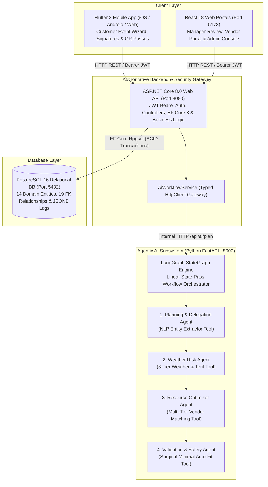
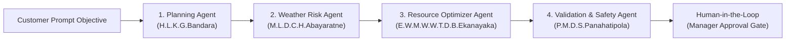

# 🎪 EventCraft AI — Integrated Full-Stack & Agentic AI Event Management Platform

[](https://github.com/gayax000/EventManagementProject/actions/workflows/main-ci.yml)
[](LICENSE)
[](https://dotnet.microsoft.com/)
[](https://react.dev/)
[](https://flutter.dev/)
[](https://www.postgresql.org/)
[](https://fastapi.tiangolo.com/)
[](https://www.langchain.com/langgraph)

---

## 📌 1. Project Overview & Business Problem

### 1.1 The Problem
Organizing weddings, corporate banquets, and celebration events in Sri Lanka involves substantial operational friction and risk:
* **Venue & Date Scheduling Friction:** High double-booking risks and opaque banquet hall pricing.
* **Unpredictable Tropical Weather:** Monsoonal rain disruptions impacting outdoor lawns and garden ceremonies without timely safeguards.
* **Budget Overruns & Vendor Fragmentation:** Manual negotiation across isolated vendors (catering, line-array audio, fresh flower decor, photography, cakes, and bridal transport).
* **Payment Insecurity & Entry Clearance:** Unverified bank transfer slips, delayed contract approvals, and chaotic paper-based guest check-in.

### 1.2 The EventCraft AI Solution
**EventCraft AI** is an enterprise-grade full-stack event management and autonomous AI planning platform featuring:
1. **Customer Mobile Application (Flutter 3):** 5-step interactive event wizard with "Auto-Fill with AI" NLP prompt parser, banquet hall selection, refreshment customization, digital contract signing (`signature`), bank transfer slip upload (`image_picker`), and tamper-evident digital QR entry pass display (`qr_flutter`).
2. **Operations & Finance Manager Portal (React 18):** Real-time proposal review, Surgical Minimal Auto-Fit budget execution ($Cost \le Budget$), price overrides, vendor switching, bank deposit verification, and QR entry pass validation.
3. **Autonomous Multi-Agent AI Subsystem (Python LangGraph):** 4 specialized domain agents executing dynamic task decomposition, 3-tier Sri Lankan weather risk auditing with automatic marquee tent safeguard injection, 5-tier vendor budget optimization, and deterministic budget safety guardrails.
4. **Authoritative Enterprise API (ASP.NET Core 8.0 & PostgreSQL 16):** Secure REST API enforcing JWT role-based access control, atomic database transactions (`IDbContextTransaction`), and audit trace logging.

---

## 👥 2. User Roles & Capabilities

| Role | Primary Interface | Key Capabilities |
| :--- | :--- | :--- |
| **Customer / Client** | Flutter Mobile / Web App | Natural language prompt auto-fill, banquet hall & session selection, proposal breakdown inspection, digital contract signing, bank deposit slip upload, and dynamic QR entry pass display. |
| **Event Manager** | React Web Portal | Review AI proposals, execute Surgical Minimal Auto-Fit ($Cost \le Budget$), apply price overrides, verify bank deposit slips, and scan visitor QR entry passes. |
| **Verified Vendor** | React Vendor Portal | Register service packages across multi-tier budgets (Decor, Photo, Sound, Transport, Cake), view assigned event work orders, and track payout statements. |
| **System Administrator** | React Admin Web & Swagger | User account provisioning, RBAC governance, security profiling, audit log inspection, and platform analytics. |

---

## 🏛️ 3. Integrated System Architecture



---

## 🧠 4. LangGraph Multi-Agent AI Subsystem

The AI subsystem executes a sequential **LangGraph StateGraph** across 4 distinct agent roles:



1. **Planning & Delegation Agent (H.L.K.G.Bandara):** Parses free-form event prompts into structured parameters (event type, guest count, target budget, preferred location) using the **NLP Entity Extractor Tool** and generates a chronological milestone task timeline.
2. **Weather Risk Agent (M.L.D.C.H.Abayaratne):** Evaluates precipitation probability via the **3-Tier Weather Tool** (*Live OpenWeather API ➡️ Regional Historical Data ➡️ Sri Lanka Monsoon Seasonal Model*). If rain risk $\ge 60\%$ on outdoor venues, it automatically injects a **Waterproof Marquee Tent safeguard** (Rs. 45,000 – 100,000).
3. **Resource Optimizer Agent (E.W.M.W.W.T.D.B.Ekanayaka):** Executes the **Multi-Tier Vendor Matching Tool**, allocating the vendor budget across 5 distinct categories: **Decor (30%)**, **Photography (25%)**, **Sound & Lighting (20%)**, **Transport (15%)**, and **Cake & Extras (10%)**.
4. **Validation & Safety Agent (P.M.D.S.Panahatipola):** Enforces deterministic budget safety ($Cost \le Budget$) using the **Surgical Minimal Auto-Fit Tool**, replacing oversized items with minimal compliant alternatives and setting a **Human-in-the-Loop (HIL)** pause gate (`PendingManagerApproval`).

---

## 👨‍💻 5. Team Ownership & Individual Deliverables

| Member Name | Student ID | Primary Business Component | Distinct Agentic AI Contribution | Individual Report |
| :--- | :--- | :--- | :--- | :--- |
| **Ekanayaka E.W.M.W.W.T.D.B.** | **IT24610808** | **Component 1: Vendor & Venue Resource Management**<br/>(Venues, Banquet Halls, Vendor Packages, Category Tiers) | **Resource Optimizer Agent:**<br/>Multi-Tier Vendor Matching Tool ($Cost \le Budget$). | [Report](file:///d:/slt_project_intern\EventManagementProject\docs\IT24610808_Ekanayaka_Individual_Report.md) |
| **Bandara H.L.K.G.** *(Group Leader)* | **IT24104333** | **Component 2: Event Request Planning & Customer Experience**<br/>(Event Lifecycle, 5-Step Wizard, Timezone Normalization) | **Planning & Delegation Agent:**<br/>NLP Entity Extractor & Dynamic Task Decomposition Tool. | [Report](file:///d:/slt_project_intern\EventManagementProject\docs\IT24104333_Bandara_Individual_Report.md) |
| **Abayaratne M.L.D.C.H.** | **IT24104335** | **Component 3: Environmental Safeguard & Weather Risk**<br/>(Weather Audits, Venue Outdoor Flags, Geolocation) | **Weather Risk Agent:**<br/>3-Tier Weather & Marquee Tent Auto-Injection Tool. | [Report](file:///d:/slt_project_intern\EventManagementProject\docs\IT24104335_Abayaratne_Individual_Report.md) |
| **Panahatipola P.M.D.S.** | **IT24100311** | **Component 4: Manager Governance & Financial Settlement**<br/>(Proposal Approval, Deposit Slip Upload, Digital QR Passes) | **Validation & Safety Agent:**<br/>Surgical Minimal Auto-Fit Tool & HIL Approval Gate. | [Report](file:///d:/slt_project_intern\EventManagementProject\docs\IT24100311_Panahatipola_Individual_Report.md) |

---

## 📂 6. Repository Directory Structure

```text
EventManagementProject/
├── .github/workflows/
│   └── main-ci.yml                 # Unified End-to-End CI Pipeline (.NET, AI, React, Flutter)
├── ai-service/                     # Python 3.11 LangGraph Multi-Agent Subsystem
│   ├── main.py                     # FastAPI entry point & StateGraph orchestration
│   ├── agent_planner.py            # Planning & Delegation Agent (Bandara)
│   ├── agent_weather_risk.py       # Weather Risk Agent (Abayaratne)
│   ├── agent_resource_optimizer.py # Resource Optimizer Agent (Ekanayaka)
│   ├── agent_validation_safety.py  # Validation & Safety Agent (Panahatipola)
│   ├── tools.py                    # Domain tools (Weather, Vendors, NLP, Auto-Fit)
│   ├── schemas.py                  # Pydantic schemas & AgentGraphState
│   └── test_agent_evaluation.py    # Pytest golden evaluation test suite
├── backend/                        # ASP.NET Core 8.0 Clean Architecture
│   ├── EventManagement.Api/        # REST Controllers, JWT Middleware, Swagger
│   ├── EventManagement.Core/       # Domain Entities, DTOs & Interfaces
│   ├── EventManagement.Infrastructure/ # EF Core AppDbContext, Migrations & Services
│   └── EventManagement.Tests/      # xUnit integration & unit test suite
├── frontend-web/                   # React 18 + TypeScript + Vite + Tailwind CSS
│   ├── src/pages/Dashboard.tsx     # Manager Operations Console & Proposal Review
│   ├── src/pages/VendorPortal.tsx  # Vendor Registration & Service Tier Authoring
│   ├── src/pages/VenuesPage.tsx    # Venue & Banquet Hall Catalog
│   └── src/services/api.ts         # Axios HTTP Client with JWT interceptors
├── mobile-app/                     # Flutter 3 Cross-Platform Application
│   ├── lib/screens/create_event_screen.dart # 5-Step Customer Wizard & AI Auto-Fill
│   ├── lib/screens/proposal_details_screen.dart # Proposal Breakdown & Slip Upload
│   ├── lib/screens/onboarding_screen.dart   # Interactive Onboarding Walkthrough
│   ├── lib/screens/policies_screen.dart     # Terms, Privacy & AI Safety Disclosures
│   └── lib/services/api_service.dart        # Dio/HTTP client & Secure Storage
├── docs/                           # Architecture & Assignment Documentation
│   ├── SE3090_Consolidated_Group_Report.md
│   ├── IT24610808_Ekanayaka_Individual_Report.md
│   ├── IT24104333_Bandara_Individual_Report.md
│   ├── IT24104335_Abayaratne_Individual_Report.md
│   └── IT24100311_Panahatipola_Individual_Report.md
├── performance/                    # k6 Load & Concurrency Performance Tests
│   ├── k6_ai_workflow_test.js
│   ├── k6_auth_test.js
│   └── k6_venues_test.js
├── Dockerfile                      # Production Docker container for ASP.NET Core
└── docker-compose.yml              # Local container orchestration
```

---

## ⚡ 7. Installation & Local Setup

### Prerequisites
* [.NET 8.0 SDK](https://dotnet.microsoft.com/download/dotnet/8.0)
* [Node.js (v20+) & npm](https://nodejs.org/)
* [Python 3.11+](https://www.python.org/)
* [Flutter SDK (v3.24+)](https://flutter.dev/)
* [PostgreSQL 16](https://www.postgresql.org/)

### Step 1: Clone Repository
```bash
git clone https://github.com/gayax000/EventManagementProject.git
cd EventManagementProject
```

### Step 2: Run Python LangGraph AI Subsystem
```bash
cd ai-service
pip install -r requirements.txt
python main.py
# Running at: http://localhost:8000 (Swagger: http://localhost:8000/docs)
```

### Step 3: Run ASP.NET Core 8.0 Backend API
```bash
cd ../backend/EventManagement.Api
dotnet restore
dotnet run
# Running at: http://localhost:8080 (Swagger: http://localhost:8080/swagger)
```
*(Database migrations and initial seed data apply automatically on startup).*

### Step 4: Run React Manager Dashboard
```bash
cd ../../frontend-web
npm install
npm run dev
# Running at: http://localhost:5173
```

### Step 5: Run Flutter Mobile App
```bash
cd ../mobile-app
flutter pub get
flutter run -d chrome # Or run on Android Emulator / Physical Device
```

---

## 🌐 8. Evaluator Test Accounts & Live URLs

### Evaluator Pre-Seeded Accounts
| Role | Email | Password | Target Interface |
| :--- | :--- | :--- | :--- |
| **System Administrator** | `admin@eventcraft.lk` | `AdminPass123!` | React Web Admin Console & Audit Logs |
| **Event Manager** | `manager@eventcraft.lk` | `ManagerPass123!` | React Web Manager Review Portal & QR Scanner |
| **Customer / Client** | `customer@eventcraft.lk` | `CustomerPass123!` | Flutter Mobile App & Customer Wizard |
| **Verified Vendor** | `vendor@eventcraft.lk` | `VendorPass123!` | React Web Vendor Package Portal |

### Production Cloud Endpoints
* **Backend REST API (Railway):** [`https://eventmanagementproject-production-94fe.up.railway.app`](https://eventmanagementproject-production-94fe.up.railway.app)
* **Swagger OpenAPI Documentation:** [`https://eventmanagementproject-production-94fe.up.railway.app/swagger`](https://eventmanagementproject-production-94fe.up.railway.app/swagger)
* **React Web Portal (Vercel):** [`https://eventcraft-admin.vercel.app`](https://eventcraft-admin.vercel.app)
* **Flutter Mobile Web (Vercel):** [`https://eventcraft-client.vercel.app`](https://eventcraft-client.vercel.app)

---

## 🧪 9. Automated Testing & Verification

Run the test suites across all four subsystems:

```bash
# 1. Backend xUnit Integration & Unit Tests
cd backend/EventManagement.Tests
dotnet test --verbosity normal

# 2. Agentic AI Golden Evaluation Pytest Suite
cd ../../ai-service
python -m unittest test_agent_evaluation.py

# 3. React Web Component & Router Tests
cd ../frontend-web
npm test

# 4. Flutter Widget & Service Tests
cd ../mobile-app
flutter test

# 5. k6 Concurrency Performance Tests
cd ../performance
k6 run k6_auth_test.js
k6 run k6_venues_test.js
```

---

## 🔒 10. Security & Ethical AI Usage Disclosure

* **Authentication & Authorization:** Stateless JWT Bearer tokens with claims-based authorization policies (`[Authorize(Roles = "Admin,Manager,Customer,Vendor")]`).
* **Cryptographic QR Clearance:** Entry pass payloads are signed with tamper-evident digital hashes and validated once upon event entrance.
* **Database Integrity:** Financial operations are wrapped in explicit EF Core atomic database transactions (`IDbContextTransaction`) with high-precision `numeric(12,2)` currency types.
* **Deterministic AI Guardrails:** Total estimated cost is programmatically bounded ($Cost \le Budget$), and all AI actions pause at a **Human-in-the-Loop** gate (`PendingManagerApproval`) requiring manager sign-off.
* **AI Usage Disclosure (CLEAR Framework Level 4):** AI coding assistants were leveraged during development for scaffolding, debugging, and test fixture drafting under student technical ownership. All architecture, database schemas, algorithms, and UI logic were verified and tested by the team.
