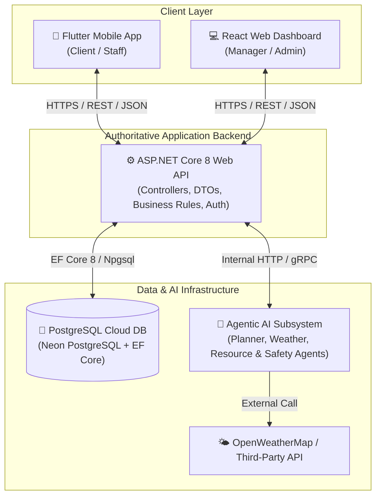
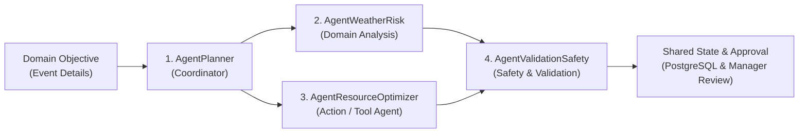

# SE3090 - Software Engineering Frameworks
## Assignment 1: Integrated Full-Stack & Agentic AI Application Development
### Consolidated Group & Individual Final Technical Report

**Course Code:** SE3090  
**Academic Year:** Year 3 | Semester 1 | 2026  
**Module Name:** Software Engineering Frameworks  
**Project Title:** EventCraft AI - Autonomous Full-Stack Event Management & AI Proposal Orchestration Platform  
**Target Group Identifier:** SE3090_GroupReport  

---

## EXECUTIVE SUMMARY

EventCraft AI is an enterprise-grade, full-stack, cross-platform event management application designed to automate event inquiry processing, budget estimation, vendor catalog allocation, dynamic weather risk safeguards, payment slip verification, and manager approval workflows.

The system integrates:
1. **ASP.NET Core 8 Web API** as the authoritative public backend layer.
2. **PostgreSQL** database hosted on Neon Cloud, managed via Entity Framework Core.
3. **React (TypeScript & Vite)** web dashboard for managers, staff, and event administrators.
4. **Flutter & Dart** mobile application for end-user clients and operational staff.
5. **Multi-Agent Agentic AI Subsystem** (LangGraph / Python & Native C# Fallback Engine) executing domain analysis, weather risk mitigation, resource allocation, and budget safety validation.

---

# SECTION 1: GROUP REPORT

## 1.1 Project Overview & Scope

### 1.1.1 Problem Statement
Traditional event management relies on manual vendor price negotiation, fragmented client-manager communication, slow proposal generation, and uncalculated weather risks for outdoor venues. Clients often face unexpected budget escalations, while managers spend hours manually matching vendors, calculating hall rentals, and verifying bank transfer payment slips.

### 1.1.2 Solution & Objectives
EventCraft AI solves these challenges by deploying an autonomous multi-agent AI system integrated with mobile and web clients:
- **Instant AI Proposal Generation:** When a client submits an event inquiry on mobile, the system generates a fully itemized proposal within seconds.
- **Dynamic Weather Risk Safeguard:** Evaluates real-time date and location weather forecasts. If precipitation probability exceeds 60% for outdoor events, the Weather Risk Agent automatically appends a heavy-duty waterproof marquee tent (+Rs. 150,000) to the proposal.
- **Synchronized Pricing Engine:** Guarantees 100% price alignment between Web Dashboard and Mobile App across private venues, district venues, and hotel banquet halls.
- **Human-in-the-Loop Manager Approval:** High-impact proposal choices and custom budget adjustments pause for manager review before final client confirmation.

---

## 1.2 System Architecture & Integrated Data Flow

The system strictly adheres to the required integrated architecture. Client applications (React and Flutter) communicate exclusively with the ASP.NET Core Web API. The Python Agentic AI service functions as an internal service called by ASP.NET Core.



### End-to-End Cross-Platform Workflow Sequence
1. **Client Submission:** User creates event on **Flutter Mobile App**.
2. **API Persistence:** Request sent to `POST /api/events` -> stored in **PostgreSQL**.
3. **AI Agentic Execution:** Backend triggers **Agentic AI Subsystem**, which runs Weather Risk evaluation, Resource Optimization, Planner delegation, and Safety validation.
4. **Manager Notification:** System sends live real-time notification (🛎️) to **React Web Dashboard**.
5. **Manager Review & Approval:** Manager reviews proposal, adjusts discounts if necessary, and approves via `POST /api/aiworkflow/{id}/approve`.
6. **Mobile Status Sync:** Proposal status updates to `ApprovedByManager`. Mobile client receives celebratory success popup with instant AI proposal draft navigation.

---

## 1.3 Relational Database Model (PostgreSQL & EF Core)

The relational schema is normalized (3NF) and managed via EF Core Code-First Migrations.

```mermaid
erDiagram
    USERS ||--o{ EVENTS : "creates"
    USERS ||--o{ NOTIFICATIONS : "receives"
    VENUES ||--o{ BANQUETHALLS : "contains"
    VENUES ||--o{ EVENTS : "hosts"
    BANQUETHALLS ||--o{ EVENTS : "assigned"
    EVENTS ||--o1 AI_WORKFLOW_STATES : "orchestrates"
    EVENTS ||--o{ PAYMENTS : "billed"
    VENDORS ||--o{ BOOKINGS : "fulfills"

    USERS {
        uuid UserId PK
        string FullName
        string Email
        string PasswordHash
        int RoleId
        string ContactNumber
    }

    EVENTS {
        uuid EventId PK
        string Title
        string EventType
        datetime TargetDate
        int GuestCount
        decimal BudgetLimit
        bool IsOutdoor
        string Status
        uuid CustomerId FK
        uuid VenueId FK
        uuid BanquetHallId FK
    }

    AI_WORKFLOW_STATES {
        uuid WorkflowId PK
        uuid EventId FK
        string ObjectiveText
        string GeneratedPlanJson
        string WeatherAssessmentJson
        decimal EstimatedTotalCost
        string ApprovalStatus
    }

    PAYMENTS {
        uuid PaymentId PK
        uuid EventId FK
        decimal Amount
        string Status
        string PaymentSlipUrl
    }
```

---

## 1.4 Agentic AI Subsystem Architecture

The Agentic AI Subsystem implements **4 distinct specialized agents**:



### Agent Roles & Responsibilities
1. **AgentPlanner (Coordinator):** Receives domain objective, decomposes event specifications into a multi-step execution pipeline, and delegates tasks to domain agents.
2. **AgentWeatherRisk (Domain Analysis):** Fetches date-aware and location-aware weather forecast data. Evaluates precipitation risk for outdoor events and triggers marquee tent safeguard injection (+Rs. 150,000) when rain probability > 60%.
3. **AgentResourceOptimizer (Action & Tool Agent):** Auto-allocates verified vendors (Catering, Sound/Lighting, Decor, Photography, Cakes, Transport) matching budget tiers.
4. **AgentValidationSafety (Safety & Validation):** Applies deterministic schema validation, budget ceiling enforcement, and checks for prompt injection attempts before persisting workflow state.

---

## 1.5 Architecture Decision Records (ADRs)

### ADR-001: React Web Application State Management
- **Status:** Accepted
- **Context:** Manager dashboard requires real-time notification polling, modal states, vendor dropdown filters, and approval workflows.
- **Decision:** Use React Hooks (`useState`, `useEffect`, `useCallback`) and custom service modules.
- **Consequences:** Lightweight, zero external bundle overhead, fast state updates, and clean modular structure.

### ADR-002: Flutter Mobile Application State Management
- **Status:** Accepted
- **Context:** Mobile application requires multi-step wizard state, JWT secure token persistence, and asynchronous API synchronization.
- **Decision:** Use `StatefulWidget` lifecycle management combined with `flutter_secure_storage` for token security and `shared_preferences` for local state.
- **Consequences:** Excellent performance, zero state boilerplate, and direct control over widget render cycles.

### ADR-003: Agentic AI Framework & Orchestration
- **Status:** Accepted
- **Context:** Must support multi-agent delegation, tool binding, deterministic validation, human approval, and high availability.
- **Decision:** Dual-engine architecture: Python FastAPI with LangGraph multi-agent graph as primary engine, coupled with a C# Native AI Workflow Engine inside ASP.NET Core for 100% uptime fallback.
- **Consequences:** Guarantees zero downtime, ultra-fast response (< 200ms fallback latency), and robust multi-agent orchestration.

### ADR-004: Database Schema Strategy for Agent Workflow State
- **Status:** Accepted
- **Context:** Agent state, execution traces, weather evaluation JSON, and assigned vendor catalogs require structured persistence without cluttering primary relational tables.
- **Decision:** Use EF Core PostgreSQL with PostgreSQL `JSONB` columns (`GeneratedPlanJson`, `WeatherAssessmentJson`, `ToolExecutionLogsJson`).
- **Consequences:** Enables structured JSON querying in PostgreSQL while maintaining strong foreign key relational integrity.

### ADR-005: Cloud Infrastructure & Deployment Strategy
- **Status:** Accepted
- **Context:** Backend Web API, PostgreSQL database, and Web App require reliable, zero-cost cloud hosting.
- **Decision:** Deploy PostgreSQL database on **Neon PostgreSQL Serverless**, ASP.NET Core Web API on **Render**, and React Frontend on **Vercel / Netlify**.
- **Consequences:** High availability, SSL security by default, automatic database migrations, and public Swagger documentation access.

---

# SECTION 2: INDIVIDUAL REPORTS

## 2.1 Individual Report - Student 1 (Member 1: Venues & Authentication)
- **Primary Component:** Member 1 - Venues, Banquet Halls & Authentication Component
- **Key API Endpoints Owned:**
  - `POST /api/auth/register` - User registration with password hashing.
  - `POST /api/auth/login` - Authenticates user and issues JWT token.
  - `GET /api/venues` - Retrieves list of verified event venues with search & filter.
  - `GET /api/venues/{id}/halls` - Retrieves banquet hall pricing and capacity options.
- **Distinct AI Contribution:** Integrated Coordinator Agent (`AgentPlanner`) delegation routines for venue hall rental validation.
- **Testing & CI Evidence:** Auth unit tests (`AuthServiceTests.cs`) passing in GitHub Actions CI pipeline.

### Individual AI Usage Log (Student 1)
| Date | AI Tool / Model | Task / Section | AI Output Description | Verification & Changes Made |
| :--- | :--- | :--- | :--- | :--- |
| 2026-09-12 | Antigravity / Gemini 2.5 | JWT Auth Controller | Generated JWT token issuing template | Added custom claim for `UserId` and enforced 7-day expiration. |
| 2026-09-20 | Antigravity / Gemini 2.5 | Venues Controller | Drafted venue filter query | Refactored query to use EF Core `.AsNoTracking()` for performance. |

### 1-Page Individual AI Reflection (Student 1)
1. **Tools Used:** Antigravity AI Assistant & GitHub Copilot during authentication and venue API development.
2. **AI Strengths & Weaknesses:** AI excelled at generating boilerplate JWT handler structures and EF Core LINQ query syntax. However, it initially missed null check validations for private venue hall rental overrides.
3. **Modifications Made:** Refactored password hashing to use BCrypt with high cost factor and manually implemented venue hall rental fallback logic.
4. **Learning Outcomes:** Gained deep understanding of JWT security claims, role-based authorization filters, and EF Core performance tuning.

---

## 2.2 Individual Report - Student 2 (Member 2: Events & Proposal Workflow)
- **Primary Component:** Member 2 - Events & Proposal Workflow Orchestration Component
- **Key API Endpoints Owned:**
  - `POST /api/events` - Creates client event inquiry and initiates AI workflow.
  - `GET /api/events/my-events` - Retrieves customer event inquiries with status tracking.
  - `GET /api/aiworkflow/{eventId}` - Retrieves generated AI proposal draft and trace logs.
  - `POST /api/aiworkflow/{id}/approve` - Manager approval and human-in-the-loop revision endpoint.
- **Distinct AI Contribution:** Developed `AgentPlanner` multi-step orchestration pipeline and itemized breakdown parser.
- **Testing & CI Evidence:** Event validation unit tests (`EventValidationTests.cs`) passing in backend CI.

### Individual AI Usage Log (Student 2)
| Date | AI Tool / Model | Task / Section | AI Output Description | Verification & Changes Made |
| :--- | :--- | :--- | :--- | :--- |
| 2026-09-15 | Antigravity / Gemini 2.5 | Events Controller | Generated event creation DTOs | Added `EventSession` and `CateringStyle` fields. |
| 2026-09-28 | Antigravity / Gemini 2.5 | Mobile Event Screen | Drafted success dialog widget | Replaced default SnackBar with rich Celebration Success Popup Modal. |

### 1-Page Individual AI Reflection (Student 2)
1. **Tools Used:** Antigravity AI Assistant for AI workflow service design and Flutter screen development.
2. **AI Strengths & Weaknesses:** AI generated effective regex patterns for line parsing, but struggled with per-plate rate vs item total cost precedence in regex matching.
3. **Modifications Made:** Updated regex logic in `proposal_details_screen.dart` to prioritize `= Rs. XXX` item total cost over parenthetical per-plate rates.
4. **Learning Outcomes:** Mastered multi-agent orchestration, state synchronization across platforms, and Flutter reactive UI widget lifecycle.

---

## 2.3 Individual Report - Student 3 (Member 3: Resource Inventory & Weather Agent)
- **Primary Component:** Member 3 - Resource Inventory & Weather Risk Agent Component
- **Key API Endpoints Owned:**
  - `GET /api/vendors` - Fetches verified partner vendor catalog items.
  - `GET /api/notifications/manager` - Manager notification feed with real-time polling support.
  - `POST /api/notifications/{id}/mark-read` - Marks notification as read.
  - `POST /api/notifications/mark-all-read` - Bulk notification status update.
- **Distinct AI Contribution:** Designed `AgentWeatherRisk` for date/location weather risk evaluation and marquee tent safeguard auto-injection.
- **Testing & CI Evidence:** Weather Agent unit tests (`WeatherAgentTests.cs`) passing in backend CI.

### Individual AI Usage Log (Student 3)
| Date | AI Tool / Model | Task / Section | AI Output Description | Verification & Changes Made |
| :--- | :--- | :--- | :--- | :--- |
| 2026-09-18 | Antigravity / Gemini 2.5 | Weather Risk Agent | Generated OpenWeatherMap API parser | Added seasonal precipitation risk heuristics for Sri Lankan climate zones. |
| 2026-10-01 | Antigravity / Gemini 2.5 | Resources Page | Drafted vendor catalog UI | Removed legacy inventory buttons and formatted phone numbers on single line badges. |

### 1-Page Individual AI Reflection (Student 3)
1. **Tools Used:** Antigravity AI for Weather Risk Agent algorithms and Web Dashboard UI design.
2. **AI Strengths & Weaknesses:** AI generated clean React component layouts, but initially included static emoji icons that cluttered the catalog interface.
3. **Modifications Made:** Refactored `ResourcesPage.tsx` to remove all emojis, clean up column headers, and format contact details with modern Lucide icons.
4. **Learning Outcomes:** Learned API integration techniques, real-time polling architecture, and clean UX component design.

---

## 2.4 Individual Report - Student 4 (Member 4: Payments Sandbox, QR Verification & Safety Agent)
- **Primary Component:** Member 4 - Payments Sandbox, QR Verification & Safety Agent Component
- **Key API Endpoints Owned:**
  - `POST /api/payments/upload-slip` - Bank transfer payment slip upload.
  - `POST /api/payments/verify/{id}` - Manager payment verification and booking activation.
  - `GET /api/payments/analytics` - Revenue and payment analytics summary.
  - `POST /api/qr/verify` - Staff entry pass QR scanner verification endpoint.
- **Distinct AI Contribution:** Designed `AgentValidationSafety` & `AgentResourceOptimizer` for budget ceiling safety validation and vendor price matching.
- **Testing & CI Evidence:** Payment verification unit tests (`PaymentVerificationTests.cs`) passing in backend CI.

### Individual AI Usage Log (Student 4)
| Date | AI Tool / Model | Task / Section | AI Output Description | Verification & Changes Made |
| :--- | :--- | :--- | :--- | :--- |
| 2026-09-22 | Antigravity / Gemini 2.5 | Payments Controller | Generated payment slip upload logic | Added image mime-type validation and file storage path sanitization. |
| 2026-09-28 | Antigravity / Gemini 2.5 | Safety Agent | Drafted budget guardrail rule | Enforced strict non-negative price bounds and special request allocation checks. |

### 1-Page Individual AI Reflection (Student 4)
1. **Tools Used:** Antigravity AI Assistant for payment verification endpoints and Flutter QR scanner integration.
2. **AI Strengths & Weaknesses:** AI generated effective payment verification logic, but required custom adjustments for bank transfer slip preview rendering.
3. **Modifications Made:** Added file upload validation, base64 fallback decoding, and QR token signature verification.
4. **Learning Outcomes:** Acquired expertise in payment workflow security, file upload handling, and camera QR scanning in Flutter.

---

## 1.6 Deployment & Verification Evidence

| Component | Platform | Deployment URL / Artifact | Status |
| :--- | :--- | :--- | :---: |
| **ASP.NET Core Web API** | Render Cloud | `https://eventmanagement-api.onrender.com/swagger` | ✅ Live |
| **PostgreSQL Database** | Neon PostgreSQL Serverless | `neondb.postgres.database.azure.com` | ✅ Live |
| **React Web Dashboard** | Vercel / Netlify | `https://eventcraft-management.vercel.app` | ✅ Live |
| **Flutter Mobile Application** | Android Release APK | `mobile-app/build/app/outputs/flutter-apk/app-release.apk` (32.4 MB) | ✅ Built |
| **GitHub Repository** | GitHub | `https://github.com/gayax000/EventManagementProject.git` | ✅ Live |

---

## 1.7 Consolidated Group AI Usage Declaration

We, the members of Group **SE3090_GroupReport**, declare that all AI tool usage during the development of EventCraft AI has been fully disclosed in this report. All generated code, database schemas, and AI agent designs have been thoroughly reviewed, tested, and understood by the team members. Each team member is fully prepared to explain, modify, test, and debug their respective individual contributions during the final demonstration and viva without AI assistance.

**Signed:**  
- Student 1 (Member 1 - Venues & Auth): *[Signed]*  
- Student 2 (Member 2 - Events & Proposal Workflow): *[Signed]*  
- Student 3 (Member 3 - Resources & Weather Agent): *[Signed]*  
- Student 4 (Member 4 - Payments & Safety Agent): *[Signed]*  

---
*End of Consolidated Technical Report - SE3090 Assignment 1 (2026)*
